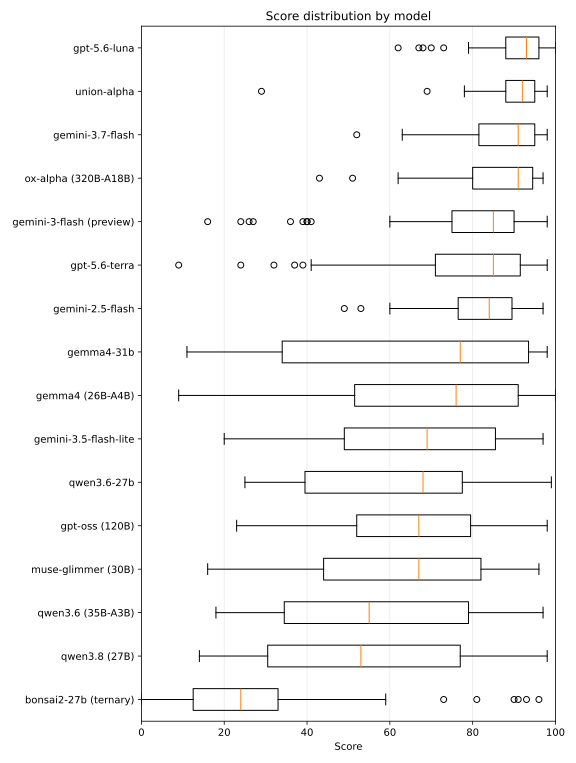

# Multilingual Podcast Reader

A learning tool that reads podcast dialogues aloud with the Web Speech API. It generates a standalone static HTML page for each topic × language combination and serves them via GitHub Pages.

## 🎯 Features

- **Independent pages per topic × language**: 4 topics × 6 languages (fr/en/es/de/ja/zh) = 24 pages + landing page
- **Read-aloud via Web Speech API**: per-speaker voice selection, global rate adjustment, play/stop/pause
- **Dynamic highlighting**: on supporting browsers, the word currently being spoken is highlighted via boundary events

### 🌐 Recommended browsers

1. **Edge**: rich online voices, dynamic highlighting supported
2. **Chrome**: online voices for the major languages

## 🎓 Content

[Multilingual Podcast Reader](https://7shi.github.io/multilingual-reader/) — a landing page from which each page can be reached via a topic × language matrix.

- 🤖 **Transformer** — the Transformer architecture's innovations (attention mechanism, parallel processing, transfer learning)  
  [All languages](https://7shi.github.io/multilingual-reader/transformer.html) · [French](https://7shi.github.io/multilingual-reader/transformer-fr.html) · [English](https://7shi.github.io/multilingual-reader/transformer-en.html) · [Spanish](https://7shi.github.io/multilingual-reader/transformer-es.html) · [German](https://7shi.github.io/multilingual-reader/transformer-de.html) · [Japanese](https://7shi.github.io/multilingual-reader/transformer-ja.html) · [Chinese](https://7shi.github.io/multilingual-reader/transformer-zh.html)
- 🎯 **Fine-tuning** — how machine learning models learn and their memory mechanisms (pre-training, transfer learning, fine-tuning)  
  [All languages](https://7shi.github.io/multilingual-reader/finetuning.html) · [French](https://7shi.github.io/multilingual-reader/finetuning-fr.html) · [English](https://7shi.github.io/multilingual-reader/finetuning-en.html) · [Spanish](https://7shi.github.io/multilingual-reader/finetuning-es.html) · [German](https://7shi.github.io/multilingual-reader/finetuning-de.html) · [Japanese](https://7shi.github.io/multilingual-reader/finetuning-ja.html) · [Chinese](https://7shi.github.io/multilingual-reader/finetuning-zh.html)
- 🌊 **Onde (waves & quantum mechanics)** — foundational concepts in quantum mechanics (wave function, uncertainty principle, diffraction of light)  
  [All languages](https://7shi.github.io/multilingual-reader/onde.html) · [French](https://7shi.github.io/multilingual-reader/onde-fr.html) · [English](https://7shi.github.io/multilingual-reader/onde-en.html) · [Spanish](https://7shi.github.io/multilingual-reader/onde-es.html) · [German](https://7shi.github.io/multilingual-reader/onde-de.html) · [Japanese](https://7shi.github.io/multilingual-reader/onde-ja.html) · [Chinese](https://7shi.github.io/multilingual-reader/onde-zh.html)
- ⚡ **Momentum (measurement theory)** — quantum measurement theory (quantum momentum, wave-particle duality, the philosophy of measurement)  
  [All languages](https://7shi.github.io/multilingual-reader/momentum.html) · [French](https://7shi.github.io/multilingual-reader/momentum-fr.html) · [English](https://7shi.github.io/multilingual-reader/momentum-en.html) · [Spanish](https://7shi.github.io/multilingual-reader/momentum-es.html) · [German](https://7shi.github.io/multilingual-reader/momentum-de.html) · [Japanese](https://7shi.github.io/multilingual-reader/momentum-ja.html) · [Chinese](https://7shi.github.io/multilingual-reader/momentum-zh.html)

## 📁 File layout

```
multilingual-reader/
├── MEMO.md                        # Decision notes, model trends, revision insights, future considerations
├── trtools/                       # Translation/evaluation tool package
├── examples/                      # Multilingual source-of-truth texts and reference-translation evaluations
│   ├── {topic}-{lang}.txt         # 4 topics × 6 languages = 24 files
│   ├── evals/                     # Reference-translation evaluations from trtools eval
│   └── tr/                        # Local-LLM translations and evaluations from trtools translate
├── DEPLOY.md                      # Build/runtime/deploy architecture details
├── Makefile                       # build / clean / serve / deploy targets
├── templates/                     # Build/deploy scripts and page templates (see templates/README.md)
├── dist/                          # Build output (gitignored)
├── experimental/                  # Translation experiment series (01-10)
└── obsolete/                      # Deprecated scripts and source data
```

## 🛠️ Translation/evaluation tools (trtools/)

Packages the tooling shared across all experiments. See [trtools/README.md](trtools/README.md) for details.

| Command | Purpose |
|---------|------|
| `uv run trtools translate` | Translate text line by line (term injection + summary compression) |
| `uv run trtools eval` | Evaluate translation quality with an LLM (5 criteria × 20 points, 100 total) |
| `uv run trtools agg` | Aggregate 3 evaluation runs by median |
| `uv run trtools term` | Extract terms/proper nouns from text and save their translations to a TSV |
| `uv run trtools batch` | Run translate → eval → aggregate in one pass |
| `uv run trtools review` | Have another model revise a high-quality baseline |

`trtools` consolidates what was learned across the experiments. See [experimental/README.md](experimental/README.md) for details.

## 📚 Reference translations and evaluation results (examples/)

[examples/](examples/) holds the reference-translation text files for each topic × language. The source language is French; English and Spanish are translated directly from French, while German, Japanese, and Chinese are re-translated via English.

Proper nouns and show names shared across all topics are pinned in [examples/tr/terms/common.tsv](examples/tr/terms/common.tsv) to avoid translation drift between runs.

[examples/evals/](examples/evals/) holds the JSON output of 3 evaluation runs from `trtools eval` (evaluator: `ollama:qwen3.6`) along with the aggregated results ([SCORES.txt](examples/evals/SCORES.txt)). Re-evaluation or additional evaluation can be run via [examples/evals/batch.sh](examples/evals/batch.sh).

**Evaluation results across all topics (median of 3 evaluations per topic, averaged per language):**

| Language | Average | Topics | Translated from | Translation | Proofreading |
|-----------|------:|---:|---|---|---|
| English   | 98.25 |  4 | French | Gemini 2.5 Pro | Claude Sonnet 4.5 |
| Japanese  | 97.00 |  4 | English | Gemini 2.5 Pro | Claude Sonnet 4.5 |
| Spanish   | 96.75 |  4 | French | Gemma 4 26B | Gemini 3.1 Pro Preview |
| Chinese   | 96.50 |  4 | English | Gemma 4 26B | Gemini 3.1 Pro Preview |
| German    | 96.25 |  4 | English | Gemma 4 26B | Gemini 3.1 Pro Preview |

For the other languages, see [MEMO.md](MEMO.md) and [examples/tr/README.md](examples/tr/README.md).



The translation-evaluation framework has reached a stable level, so going forward, per-model directories are added under [examples/tr/onde/](examples/tr/onde/) and used as a language-capability benchmark. See [examples/tr/ADD_MODEL.md](examples/tr/ADD_MODEL.md) for the procedure.

## 📝 Adding data

`examples/{topic}-{lang}.txt` is the source of truth. The format is one utterance per line, `speaker: text` (a full-width colon `：` is also accepted).

Steps to add a new topic:

1. Generate the multilingual translations with `trtools`
2. Place `examples/{topic}-{lang}.txt` for all 6 languages
3. Add the new topic to `TOPIC_LABELS` in `build.py`
4. `make build` regenerates all 24 + N pages

### Multilingual translation (trtools)

`trtools translate` translates line by line (blank lines preserved, term injection + summary compression).

```bash
# Pre-extract terms, then translate
uv run trtools term extract base.txt -f French -m ollama:gemma4:12b -o terms.json
uv run trtools term translate terms.json -t Spanish -m ollama:gemma4:12b -o terms.tsv
uv run trtools translate base.txt -f French -t Spanish -o output-es.txt -m ollama:gemma4:26b --terms-json terms.json --terms-tsv terms.tsv
```

## 🚀 Build and deploy

See [templates/README.md](templates/README.md) for the build/deploy steps.
