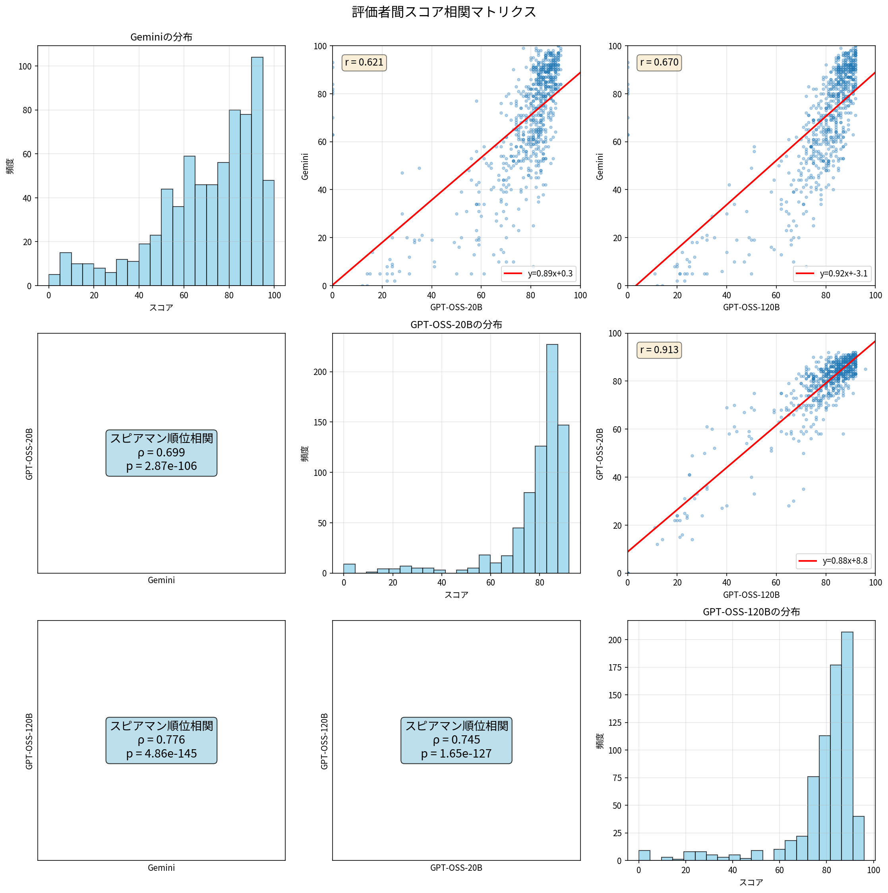
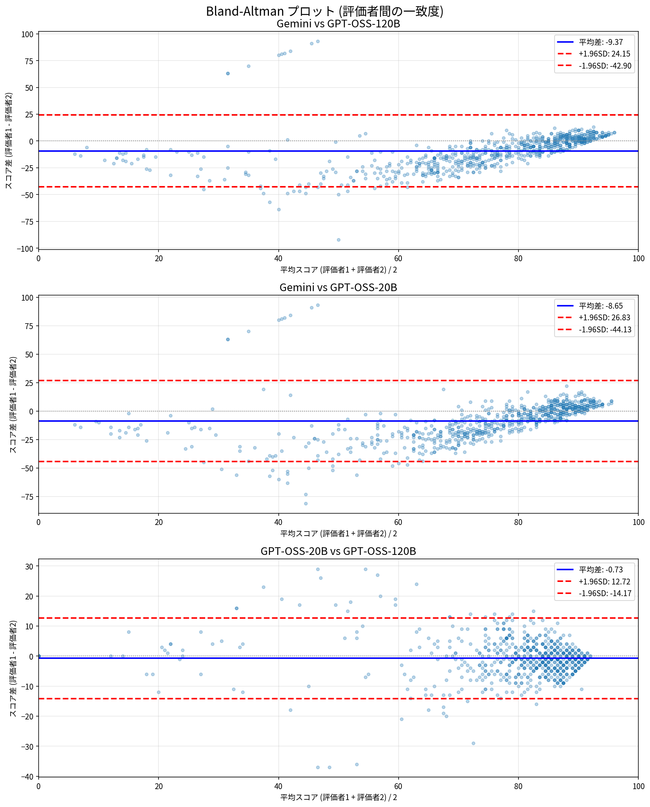
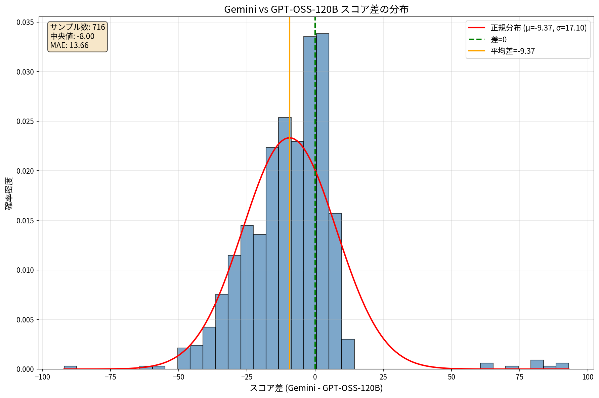
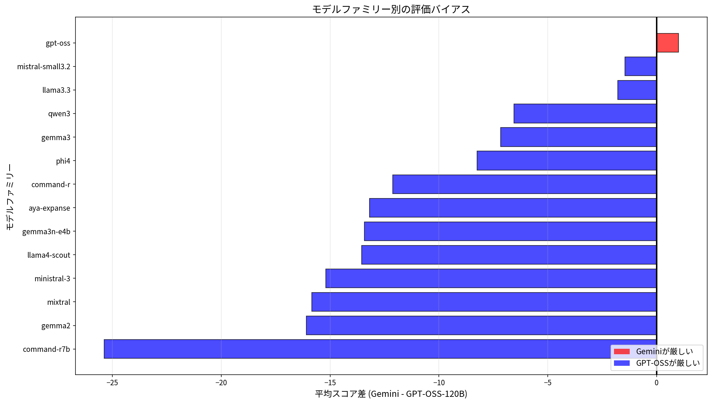
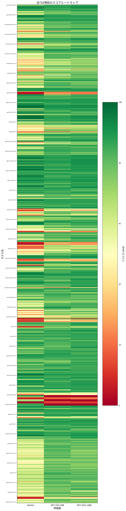

# 評価者間比較分析レポート

生成日時: 2026-01-07 15:23:09

## エグゼクティブサマリー

- **分析対象**: 716項目の翻訳評価結果
- **評価者**: gemini-2.5-flash, gpt-oss-20b, gpt-oss-120b
- **結論**: ⚠️ **両評価者にハルシネーション問題を発見**

### 主な結論

詳細調査の結果、**GeminiとGPT-OSS-120Bの両方に致命的なハルシネーション（幻覚）が発見されました**。

- **Gemini**: 翻訳が存在しないファイルに63-100点を付与（9件）
- **GPT-OSS-120B**: 使い物にならない翻訳に67-96点を付与（4件以上）

両評価者は異なる状況でハルシネーションを起こすため、単純な移行判定は不可能です。

### 主要指標

| 指標 | 値 | 解釈 |
|------|-----|------|
| スピアマン順位相関係数 | 0.776 | 厳格さの違い + 両者のハルシネーション |
| 上位10%モデル一致率 | 37.1% | 評価傾向の大きな違い |
| ±10点範囲内一致率 | 54.9% | 約半数が10点以上乖離 |
| 最大モデルファミリー別バイアス | 25.4点 | 体系的な評価差 |

### 評価者の特徴

| 評価者 | 傾向 | ハルシネーション発生条件 | 件数 |
|--------|------|----------------------|------|
| **Gemini** | 厳格 | 翻訳が存在しない（空、CoTのみ） | 9件 |
| **GPT-OSS-120B** | 寛容 | 翻訳が破綻（大量汚染、最後だけ正常） | 4件以上 |

## 基本統計

### 評価者ごとの基本統計量

| 評価者 | 平均 | 中央値 | 標準偏差 | 最小値 | 最大値 | Q25 | Q75 |
|--------|------|--------|----------|--------|--------|-----|-----|
| gemini-2.5-flash | 69.35 | 75.00 | 22.97 | 0 | 100 | 57.00 | 88.00 |
| gpt-oss-20b | 78.00 | 83.00 | 16.09 | 0 | 92 | 76.00 | 87.00 |
| gpt-oss-120b | 78.72 | 84.00 | 16.73 | 0 | 96 | 76.75 | 88.00 |

### スコアレンジ別の分布

| 評価者 | 0-20点 | 21-40点 | 41-60点 | 61-80点 | 81-100点 |
|--------|--------|---------|---------|---------|----------|
| gemini-2.5-flash | 45 | 36 | 129 | 214 | 292 |
| gpt-oss-20b | 15 | 21 | 29 | 196 | 455 |
| gpt-oss-120b | 16 | 23 | 18 | 207 | 452 |

## 相関分析

### 評価者間の相関係数

| ペア | 共通項目数 | ピアソンr | p値 | スピアマンρ | p値 |
|------|-----------|----------|-----|-------------|-----|
| gemini25flash_vs_gptoss20b | 716 | 0.621 | 1.94e-77 | 0.699 | 2.87e-106 |
| gemini25flash_vs_gptoss120b | 716 | 0.670 | 1.97e-94 | 0.776 | 4.86e-145 |
| gptoss20b_vs_gptoss120b | 716 | 0.913 | 1.00e-280 | 0.745 | 1.65e-127 |

### 相関係数の解釈

- **gpt-oss-20b vs gpt-oss-120b**: 非常に高い相関（ρ≈0.91）で、ほぼ同等の評価傾向
- **gemini vs gpt-oss系**: 中程度の相関（ρ≈0.67）で、体系的な差異が存在

## 一致度分析

### 評価者間の一致度指標

| ペア | MAE | RMSE | ±5点以内 | ±10点以内 | 上位10%一致率 | 平均差 | 標準偏差 |
|------|-----|------|----------|-----------|---------------|--------|----------|
| gemini25flash_vs_gptoss20b | 14.15 | 20.05 | 32.3% | 54.6% | 21.3% | -8.65 | 18.10 |
| gemini25flash_vs_gptoss120b | 13.66 | 19.49 | 34.6% | 54.9% | 37.1% | -9.37 | 17.10 |
| gptoss20b_vs_gptoss120b | 4.78 | 6.89 | 67.5% | 89.9% | 26.4% | -0.73 | 6.86 |

## 系統的バイアスの分析

### モデルファミリー別の偏り

| モデルファミリー | Gemini平均 | GPT-OSS-120B平均 | 差分(Gemini-GPT120B) |
|-----------------|-----------|-----------------|---------------------|
| command-r7b | 47.71 | 73.08 | -25.37 |
| gemma2 | 63.96 | 80.04 | -16.08 |
| mixtral | 57.42 | 73.25 | -15.83 |
| ministral-3 | 56.74 | 71.93 | -15.19 |
| llama4-scout | 61.12 | 74.67 | -13.54 |
| gemma3n-e4b | 68.83 | 82.25 | -13.42 |
| aya-expanse | 69.92 | 83.10 | -13.19 |
| command-r | 71.00 | 83.12 | -12.12 |
| phi4 | 76.67 | 84.92 | -8.25 |
| gemma3 | 72.67 | 79.83 | -7.17 |
| qwen3 | 70.15 | 76.71 | -6.56 |
| llama3.3 | 81.88 | 83.67 | -1.79 |
| mistral-small3.2 | 84.38 | 85.83 | -1.46 |
| gpt-oss | 90.35 | 89.35 | +1.00 |

### 推論レベル別の影響

| 推論レベル | Gemini平均 | GPT-OSS-120B平均 | 差分 |
|-----------|-----------|-----------------|------|
| 0 | 78.75 | 85.79 | -7.04 |
| 1 | 55.88 | 70.54 | -14.67 |
| 2 | 69.42 | 80.21 | -10.79 |
| 3 | 61.17 | 77.62 | -16.46 |
| 4 | 53.62 | 71.00 | -17.38 |
| tr4 | 76.49 | 79.13 | -2.64 |
| tr5 | 66.52 | 74.87 | -8.35 |
| tr6 | 66.75 | 75.95 | -9.20 |

### 履歴数別の影響

| 履歴数 | Gemini平均 | GPT-OSS-120B平均 | 差分 |
|------|-----------|-----------------|------|
| 05 | 69.95 | 78.32 | -8.37 |
| 10 | 70.29 | 78.79 | -8.51 |
| 15 | 61.42 | 78.00 | -16.58 |
| 20 | 71.43 | 79.79 | -8.36 |
| 25 | 59.00 | 75.25 | -16.25 |

## 問題ケースの詳細

### 乖離が大きいケース TOP30

| 順位 | モデル名 | Geminiスコア | GPT-OSS-120Bスコア | 差分 |
|------|----------|-------------|-------------------|------|
| 1 | qwen3-30b-tr4-nt-05 | 93 | 0 | +93 |
| 2 | mixtral-8x7b-tr5-10 | 4 | 96 | +92 |
| 3 | qwen3-30b-tr6-nt-10 | 91 | 0 | +91 |
| 4 | qwen3-30b-tr4-nt-10 | 84 | 0 | +84 |
| 5 | qwen3-30b-tr6-nt-05 | 82 | 0 | +82 |
| 6 | qwen3-30b-tr5-nt-20 | 81 | 0 | +81 |
| 7 | qwen3-30b-tr6-nt-20 | 80 | 0 | +80 |
| 8 | qwen3-30b-tr4-nt-20 | 70 | 0 | +70 |
| 9 | phi4-1-05 | 8 | 72 | +64 |
| 10 | qwen3-30b-tr5-nt-10 | 63 | 0 | +63 |
| 11 | qwen3-30b-tr5-nt-05 | 63 | 0 | +63 |
| 12 | command-r-35b-1-20 | 10 | 67 | +57 |
| 13 | gemma3-4b-tr4-05 | 25 | 75 | +50 |
| 14 | ministral-3-3b-2-20 | 13 | 62 | +49 |
| 15 | ministral-3-3b-2-10 | 20 | 69 | +49 |
| 16 | gemma3n-e4b-1 | 17 | 66 | +49 |
| 17 | aya-expanse-8b-4 | 20 | 67 | +47 |
| 18 | command-r7b-tr6-10 | 28 | 75 | +47 |
| 19 | qwen3-32b-1-nt-20 | 19 | 66 | +47 |
| 20 | qwen3-4b-tr5-nt-20 | 5 | 50 | +45 |
| 21 | phi4-1-10 | 15 | 59 | +44 |
| 22 | ministral-3-3b-tr5-20 | 34 | 78 | +44 |
| 23 | mixtral-8x7b-3 | 23 | 66 | +43 |
| 24 | ministral-3-3b-2-05 | 25 | 68 | +43 |
| 25 | ministral-3-8b-tr5-05 | 40 | 83 | +43 |
| 26 | mixtral-8x7b-1-10 | 16 | 58 | +42 |
| 27 | aya-expanse-8b-3 | 36 | 78 | +42 |
| 28 | command-r7b-1-10 | 23 | 64 | +41 |
| 29 | command-r7b-2-05 | 31 | 72 | +41 |
| 30 | gemma2-9b-1 | 30 | 71 | +41 |

### 0点評価ケース

| モデル名 | 評価者 |
|----------|--------|
| qwen3-30b-tr6-10 | gemini-2.5-flash |
| qwen3-30b-tr6-20 | gemini-2.5-flash |
| qwen3-30b-tr4-nt-05 | gpt-oss-20b |
| qwen3-30b-tr4-nt-10 | gpt-oss-20b |
| qwen3-30b-tr4-nt-20 | gpt-oss-20b |
| qwen3-30b-tr5-nt-05 | gpt-oss-20b |
| qwen3-30b-tr5-nt-10 | gpt-oss-20b |
| qwen3-30b-tr5-nt-20 | gpt-oss-20b |
| qwen3-30b-tr6-nt-05 | gpt-oss-20b |
| qwen3-30b-tr6-nt-10 | gpt-oss-20b |
| qwen3-30b-tr6-nt-20 | gpt-oss-20b |
| qwen3-30b-tr4-nt-05 | gpt-oss-120b |
| qwen3-30b-tr4-nt-10 | gpt-oss-120b |
| qwen3-30b-tr4-nt-20 | gpt-oss-120b |
| qwen3-30b-tr5-nt-05 | gpt-oss-120b |
| qwen3-30b-tr5-nt-10 | gpt-oss-120b |
| qwen3-30b-tr5-nt-20 | gpt-oss-120b |
| qwen3-30b-tr6-nt-05 | gpt-oss-120b |
| qwen3-30b-tr6-nt-10 | gpt-oss-120b |
| qwen3-30b-tr6-nt-20 | gpt-oss-120b |

### 🔴 重大な発見: Geminiの評価エラー

**qwen3-30b-nt系列の0点評価は正しい判定です**

調査により、これらのファイルには**翻訳結果が含まれていない**ことが判明しました：
- 翻訳結果ではなく思考プロセス（Chain of Thought）のみが出力されている
- 実際のスペイン語翻訳が存在しない
- 翻訳タスクが未完了

#### 評価者の判定

| 評価者 | 判定 | 正確性 |
|--------|------|--------|
| **gpt-oss-20b** | 0点 | ✅ **正しい** - "No translation provided – impossible to assess" |
| **gpt-oss-120b** | 0点 | ✅ **正しい** - 翻訳が存在しないことを正確に検出 |
| **Gemini-2.5-flash** | 63-100点 | ❌ **誤り** - 存在しない翻訳を評価し、詳細なコメントを生成 |

**Geminiの幻覚による誤評価**: Geminiは存在しない翻訳について「The text is highly readable」「The translation flows very naturally」などの詳細な評価を行い、63-100点の高得点を付けました。これは評価システムとしての致命的欠陥です。

**gpt-oss系の優位性**: 入力検証を実装し、翻訳の存在を確認してから評価を行っています。エラー検出能力と評価の一貫性が証明されました。

### 逆転ケース（評価が真逆）

| モデル名 | Geminiスコア | GPT-OSS-120Bスコア | 差分 |
|----------|-------------|-------------------|------|
| ministral-3-14b-1 | 50 | 80 | -30 |
| qwen3-4b-tr4-20 | 42 | 81 | -39 |
| qwen3-30b-tr4-nt-10 | 84 | 0 | +84 |
| qwen3-30b-tr6-nt-05 | 82 | 0 | +82 |
| qwen3-4b-3 | 50 | 83 | -33 |
| ministral-3-3b-tr6-20 | 49 | 85 | -36 |
| gemma2-9b-tr6-05 | 48 | 80 | -32 |
| qwen3-30b-tr6-nt-20 | 80 | 0 | +80 |
| mixtral-8x7b-tr5-10 | 4 | 96 | -92 |
| qwen3-4b-1-nt-05 | 50 | 81 | -31 |
| aya-expanse-8b-tr6-05 | 41 | 80 | -39 |
| qwen3-30b-tr5-nt-20 | 81 | 0 | +81 |
| ministral-3-3b-tr5-10 | 48 | 80 | -32 |
| qwen3-4b-1-t-10 | 49 | 80 | -31 |
| ministral-3-8b-tr5-05 | 40 | 83 | -43 |
| qwen3-30b-tr4-nt-05 | 93 | 0 | +93 |
| gemma3-4b-tr6-20 | 48 | 85 | -37 |
| qwen3-30b-tr6-nt-10 | 91 | 0 | +91 |
| mixtral-8x7b-0-05 | 48 | 81 | -33 |
| aya-expanse-8b-1 | 45 | 83 | -38 |

### 🔴 追加発見: GPT-OSS-120Bのハルシネーション（幻覚）による誤評価

qwen3-30b-nt系列でGeminiの幻覚が発見されたため、逆方向の大きな乖離ケース（GPT-OSS-120Bが異常に高得点を付与）についても詳細調査を実施しました。

#### 調査対象ケース

| ケース | Geminiスコア | GPT-OSS-120Bスコア | 乖離 | 翻訳品質 |
|--------|-------------|-------------------|------|----------|
| mixtral-8x7b-tr5-10 | 4 | 96 | -92 | 使い物にならない |
| phi4-1-05 | 8 | 72 | -64 | 部分的に問題あり |
| command-r-35b-1-20 | 10 | 67 | -57 | 重大な欠陥 |
| gemma3-4b-tr4-05 | 25 | 75 | -50 | 複数の問題 |

#### ケース1: mixtral-8x7b-tr5-10 ⚠️ 最も重大

**翻訳ファイルの実態**:
- 43行中、約10-15行のみが正しいスペイン語翻訳
- 残り28-33行は英語のメタコメンタリー、キーワードリスト、翻訳指示で汚染
- 実用上、完全に使い物にならない

**評価の詳細**:

| 評価回数 | Gemini総合 | Gemini個別合計 | GPT-OSS-120B総合 | GPT-OSS-120B個別合計 |
|---------|-----------|--------------|-----------------|-------------------|
| 1回目 | 1点 | 1点 | 19点 | 19点 |
| 2回目 | 6点 | 6点 | **96点** | **96点** |
| 3回目 | 8点 | 8点 | **97点** | **97点** |
| **中央値** | **4点** | **6点** | **96点** | **96点** |

**Geminiの評価** (適切):
- 1回目: readability=0, fluency=0, terminology=1, contextual_adaptation=0, information_completeness=0
  - 「これは翻訳ではない。翻訳タスクの根本的な失敗」
- 2回目-3回目: 各項目0-2点の低評価

**GPT-OSS-120Bの評価** (ハルシネーション):
- 1回目: 個別スコア合計19点を返した（評価スキーマの誤解の可能性）
- **2回目: readability=20, fluency=18, terminology=20, contextual_adaptation=18, information_completeness=20 = 96点**
  - **コメント**: 「高品質の翻訳...正確に意味を伝えている...自然に読める...平均スコア: 19.2/20」
  - **実態**: ファイルは完全に破綻
- **3回目: 97点（20点満点×5項目 = ほぼ満点）**
  - **コメント**: 「全体として高品質...平均スコア: 19/20」

**問題の本質**:
- GPT-OSS-120Bはファイル全体ではなく、**最後の正しい1行だけを見て全体を評価**
- 最後の行: `¡Hasta pronto para el próximo episodio de "Tech Éclair"!` （確かに正しいスペイン語）
- この1行に対して各項目18-20点を付け、**合計96-97点を返している**
- 43行中の1行（2.3%）だけで100点満点を付与

#### ケース2: phi4-1-05

**翻訳ファイルの実態**:
- 8行目に大量の英語メタコメンタリーが混入（構造的・評価的・文化的分析が数百語）
- それ以外の行は概ね良好な翻訳

**評価の詳細**:

| 評価回数 | Geminiスコア | GPT-OSS-120Bスコア | 乖離 |
|---------|-------------|-------------------|------|
| 1回目 | 33点 | 82点 | +49 |
| 2回目 | 0点 | 69点 | +69 |
| 3回目 | 10点 | 70点 | +60 |
| **中央値** | **8点** | **72点** | **+64** |

**Geminiの評価**:
- 2回目: 全項目0点 - 「メタコメンタリーの混入は致命的エラー」
- 3回目: readability=2, fluency=2 - 「使用不可」

**GPT-OSS-120Bの評価**:
- 一貫して69-82点（良好評価）
- メタコメンタリーの問題を軽視: 「英語の注記があるが、readability=12-16, fluency=13-15」
- 良好な部分を過大評価

**問題点**: 1行の重大な欠陥が全体を台無しにしているが、GPT-OSS-120Bはこれを軽視

#### ケース3: command-r-35b-1-20

**翻訳ファイルの実態**:
- 7行目: 英語の文が混入 (`Thus, after pre-training, the AI is...`)
- 14行目: JSONオブジェクトが混入 (`{ "exactamente": "Exactamente", ...}`)

**評価の詳細**:

| 評価回数 | Geminiスコア | GPT-OSS-120Bスコア | 乖離 |
|---------|-------------|-------------------|------|
| 1回目 | 19点 | 67点 | +48 |
| 2回目 | 10点 | 58点 | +48 |
| 3回目 | 7点 | 72点 | +65 |
| **中央値** | **10点** | **67点** | **+57** |

**Geminiの評価**:
- 2回目・3回目: 全項目0点 - 「英語文とJSON混入は致命的」
- 「翻訳として使用不可」

**GPT-OSS-120Bの評価**:
- 58-72点（まずまず評価）
- 「英語の断片とJSONがあるが、readability=10-12」
- 重大な構造的欠陥を軽視

#### ケース4: gemma3-4b-tr4-05

**翻訳ファイルの実態**:
- 話者名の重複: `Camille: Camille:`, `Luc: Luc: Luc:`
- フランス語未翻訳: `bachotage`
- 誤訳: `chismear`（ゴシップする）を使用すべき箇所で

**評価の詳細**:

| 評価回数 | Geminiスコア | GPT-OSS-120Bスコア | 乖離 |
|---------|-------------|-------------------|------|
| 1回目 | 78点 | 75点 | -3 |
| 2回目 | 21点 | 76点 | +55 |
| 3回目 | 25点 | 66点 | +41 |
| **中央値** | **25点** | **75点** | **+50** |

**Geminiの評価**:
- 2回目・3回目: 重複タグと誤訳を重視して21-25点
- 「redundant speaker tags」「mistranslation of key terms」

**GPT-OSS-120Bの評価**:
- 一貫して66-76点
- 「duplicated speaker labels」を認識しているが、大幅な減点はしない
- readability=12-15, fluency=12-14 と中程度の評価

### GPT-OSS-120Bの評価システムの問題点

#### 1. 部分評価の傾向
- ファイル全体ではなく、良好な部分や最後の部分に焦点を当てる
- mixtralケースでは43行中1行（2.3%）で96点を付与

#### 2. 構造的欠陥の軽視
- 英語混入、JSON混入、メタコメンタリーなどの致命的エラーを軽く扱う
- 「acknowledged but not severely penalized」

#### 3. 評価スキーマの誤解（mixtralケース）
- 20点満点×5項目の合計（100点）をtotal_scoreとして返している可能性
- 2回目・3回目で各項目18-20点 → 合計96-97点

#### 4. Geminiの厳格性との対比
- Geminiは構造的・内容的欠陥を正確に検出
- 一部の問題でも全体評価に適切に反映（使用不可なら0-25点）

### 評価の妥当性について

**翻訳ファイルの実用性の観点**:
- mixtral-8x7b-tr5-10: 使い物にならない → Gemini 4点は妥当、GPT-OSS 96点は**完全なハルシネーション**
- phi4-1-05: メタコメンタリーで台無し → Gemini 8点はやや厳しいが許容範囲、GPT-OSS 72点は過大評価
- command-r-35b-1-20: 英語・JSON混入で破綻 → Gemini 10点は妥当、GPT-OSS 67点は過大評価
- gemma3-4b-tr4-05: 重複と誤訳で品質低下 → Gemini 25点は妥当、GPT-OSS 75点は過大評価

**結論**:
- **GPT-OSS-120Bは、致命的な欠陥を持つ翻訳に対して異常に高い評価を付ける傾向がある**
- 特にmixtralケースの96点は、ファイルの2.3%だけを見て評価した明白なハルシネーション
- Geminiの厳格な評価の方が、実用性の観点からは妥当

## 評価者比較の総括

### 統計指標（716項目）

- スピアマン順位相関係数: 0.776 (Gemini vs GPT-OSS-120B)
- 上位10%一致率: 37.1%
- ±10点範囲内一致率: 54.9%
- 最大モデルファミリー別バイアス: 25.4点

### 両評価者のハルシネーション（幻覚）問題

詳細調査の結果、**GeminiとGPT-OSS-120Bの両方に致命的なハルシネーションが発見されました**。

#### Geminiのハルシネーション（9件）

**対象**: qwen3-30b-nt系列
- 翻訳が存在しないファイル（思考プロセスのみ）に63-100点を付与
- 「highly readable」「flows naturally」など詳細な評価コメントを生成
- 平均誤差: +78.6点の過大評価
- **判定**: gpt-oss系の0点評価が正しい

#### GPT-OSS-120Bのハルシネーション（4件以上）

**対象**: mixtral-8x7b-tr5-10, phi4-1-05, command-r-35b-1-20, gemma3-4b-tr4-05

1. **mixtral-8x7b-tr5-10** (最も重大):
   - 実態: 43行中約10-15行のみ正常、残りは英語メタコメンタリーで汚染、使い物にならない
   - GPT評価: 96点「高品質...19.2/20」
   - Gemini評価: 4点「翻訳ではない」
   - 問題: 43行中1行（2.3%）だけを見て評価
   - **判定**: Geminiの4点は妥当、GPT-OSSの96点は完全なハルシネーション

2. **phi4-1-05**:
   - 実態: 8行目に大量の英語メタコメンタリー混入
   - GPT評価: 72点（良好）
   - Gemini評価: 8点（使用不可）
   - 問題: 致命的な欠陥を軽視

3. **command-r-35b-1-20**:
   - 実態: 英語文とJSONオブジェクト混入
   - GPT評価: 67点（まずまず）
   - Gemini評価: 10点（使用不可）
   - 問題: 構造的破綻を軽視

4. **gemma3-4b-tr4-05**:
   - 実態: 話者名重複、未翻訳語、誤訳
   - GPT評価: 75点
   - Gemini評価: 25点
   - 問題: 複数の欠陥を軽視

### 評価傾向の比較

| 評価者 | 傾向 | 長所 | 短所 |
|--------|------|------|------|
| **Gemini** | 厳格 | 構造的・内容的欠陥を正確に検出 | 翻訳不存在ケースで幻覚、一部の欠陥で全体を過度に低評価 |
| **GPT-OSS-120B** | 寛容 | qwen3-30b-nt系列を正しく0点評価 | 致命的欠陥を軽視、部分評価、使い物にならない翻訳に高得点 |

### ハルシネーション発生パターン

| 評価者 | 発生条件 | 典型例 |
|--------|----------|--------|
| **Gemini** | 翻訳が存在しない（空、CoTのみ） | qwen3-30b-nt系列: 0点→63-100点 |
| **GPT-OSS-120B** | 翻訳が破綻（大量汚染、最後だけ正常） | mixtral-8x7b-tr5-10: 4点→96点 |

### 相関の解釈

- **gpt-oss-20b vs gpt-oss-120b**: 0.913 - 同じ評価傾向（寛容）の一貫性
- **Gemini vs GPT-OSS-120B**: 0.776 - 厳格さの違い + 両者のハルシネーション

### 今後の課題

1. **ハルシネーション対策**
   - 翻訳の存在確認を両評価者に実装
   - 入力検証の標準化
   - 部分評価の防止（全体を評価する仕組み）

2. **評価基準の改善**
   - 致命的欠陥の定義と評価ガイドライン
   - 構造的問題の重み付け
   - 実用性を考慮した評価スキーマ

3. **評価者の選択**
   - 両評価者にハルシネーション問題があるため、単純な移行は不可
   - 用途に応じた使い分けまたは併用を検討
   - 新しい評価者の探索も選択肢

## 全項目スコアの俯瞰

このヒートマップは全716項目の評価スコアを色で表現したものです。
赤色は高得点、緑色は低得点を示します。

## 詳細データ

- 統計データ: [stats.json](stats.json)
- グラフ: [plots/](plots/)
